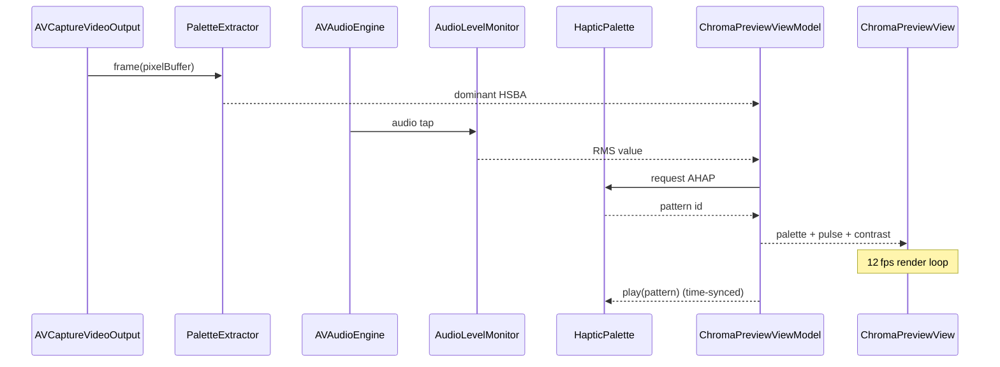
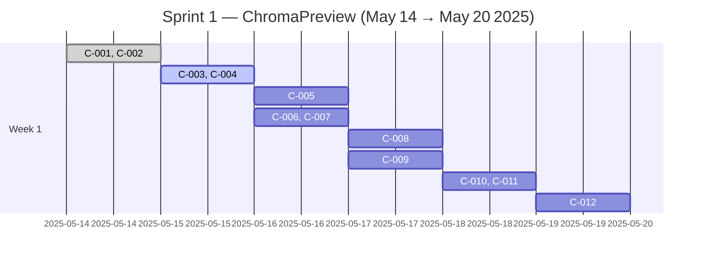

# ChromaPreview-FeaturePlan-Lux

<!--@START_MENU_TOKEN@-->Summary<!--@END_MENU_TOKEN@-->

## Overview

<!--@START_MENU_TOKEN@-->Text<!--@END_MENU_TOKEN@-->

### Section header

<!--@START_MENU_TOKEN@-->Text<!--@END_MENU_TOKEN@-->

# ChromaPreview — Feature Plan  
*Author: Lux Marín – Sprint start: May 14 2025*

---

## 1 · Purpose  
Deliver a **real‑time sensory overlay** that previews color, audio intensity, and haptics so users can “feel the scene” before recording.

---

## 2 · System Flow (Mermaid)

---

## 3 · Architecture

| Layer | File | Responsibility |
|-------|------|----------------|
| **UI** | `ChromaPreviewView.swift` | SwiftUI overlay & animation loop |
| **ViewModel** | `ChromaPreviewViewModel.swift` | Publishes palette, RMS, contrast, migraine‑mode state |
| **Services** | `PaletteExtractor.swift` | Vision dominant‑color detect (4 Hz, ⅕ res) |
|  | `AudioLevelMonitor.swift` | Live RMS publisher via `Combine` |
|  | `HapticPalette.swift` | HSBA→AHAP map + playback |
| **Tests** | `ChromaPreviewTests.swift` | Snapshots + HSBA→AHAP unit |

---

## 4 · Granular Task Board (for Grooming)

| ID | Story | Acceptance Criteria | Est. Pts |
|---|--------|--------------------|:--:|
| C‑001 | Scaffold `ChromaPreviewView` + VM | Compiles; preview displays placeholder palette | 2 |
| C‑002 | Implement `PaletteExtractor` | Returns HSBA within ≤40 ms @ 4 Hz | 3 |
| C‑003 | Bind palette stream to UI swatches | Swatches update live; 15 Pro & 12 mini | 1 |
| C‑004 | Implement `AudioLevelMonitor` | RMS updates every 50 ms; unit test RMS range | 2 |
| C‑005 | Animate “breathing” pulse @ 12 fps | Pulse amplitude keyed to RMS; Reduce‑Motion compliant | 2 |
| C‑006 | Map HSBA→AHAP & trigger haptics | Correct pattern ID verified in unit test | 2 |
| C‑007 | Flash motor icon in‑sync | Icon appears ≤10 ms from haptic start | 1 |
| C‑008 | WCAG auto‑contrast adjust | Contrast ≥3 : 1 under varied palettes; UITest passes | 3 |
| C‑009 | Add **Migraine Mode** toggle | Toggle pauses animations & haptics; persists via `AppStorage` | 2 |
| C‑010 | Snapshot tests (light/dark, devices) | Reference images committed; CI green | 2 |
| C‑011 | Unit test HSBA→AHAP table | 100 % lines & branches in mapper | 1 |
| C‑012 | Write README snippet & demo clip | Markdown section + .mov in /media | 1 |

**Velocity target:** 21 points / 1‑week sprint  

---

## 5 · Timeline (Mermaid Gantt)

---

## 6 · Risks & Mitigations

| Risk | Mitigation |
|------|------------|
| Palette extraction latency | Subsample frame & throttle to 4 Hz |
| Haptic/UI desync | Use common `CACurrentMediaTime()` timestamp |
| Permission races (camera/mic) | Defer service init until both granted |
| Motion sickness for some users | **Migraine Mode** + obey **Reduce Motion** |

---

## 7 · Definition of Done

* All tasks C‑001 → C‑012 accepted.  
* CI pipeline passes (unit, snapshot, UITests).  
* Demo clip reviewed by design & accessibility champions.  
* Performance: CPU ≤15 %, GPU ≤20 % on 12 mini during preview.  
* No WCAG contrast violations (auto‑audited).  

---

**Commit prefix:** `Breathe‑palette ✨`  
**Easing curve:** `cubic‑Bezier(0.4, 0, 0.2, 1)`  

> *Ready for grooming—please poke holes & re‑estimate as needed!*
