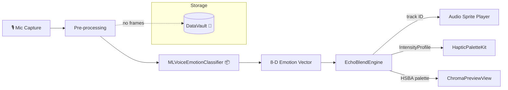

<file name=0 path=EchoBlend-FeaturePlan-Iris.md># EchoBlend – Feature Plan (RFC)  
*Author: Iris Zhang – On‑device AI/ML & Privacy*  
*Last updated: {{TODAY}}*

---

## 1  Summary
EchoBlend transforms raw voice input into emotionally‑aware audio sprites and matching visual/haptic accents, entirely on‑device.  
This RFC outlines the classifier integration, privacy scaffolding, and developer‑facing API necessary to ship v‑1 of EchoBlend without any cloud dependency and with strict data‑retention boundaries.

## 2  Problem / Opportunity
Interactive replays feel lifeless when every recording is treated the same. Attaching a fast, lightweight emotion classifier lets us:
* **Adapt** music layers, haptic rhythms, and colour palettes in real‑time.  
* **Personalise** replays without sending raw audio off‑device.  
* **Delight** users with subtle changes that match their tone of voice.

## 3  Goals
| ID | Goal | Success Metric |
|---|------|----------------|
| G‑1 | Classify 8 emotions on‑device | ≥ 90 % macro‑F1 on balanced dataset |
| G‑2 | Sub‑10 ms inference on A17; ≤ 25 ms on A13 | Median latency (XCTest benchmark) |
| G‑3 | Zero raw‑audio persistence | Static & runtime privacy audit passes |
| G‑4 | Public Swift API ≤ 5 lines to adopt | DX survey: “very easy” |

### Non‑Goals
* Cloud fallback or federation (future work).  
* Multilingual emotion models (English only for v‑1).

## 4  Architecture Overview


### 4.1  Engine & Audio‑Feel Scope (Leo Ramirez)

* **Layer‑picker** – Route the 8‑D emotion vector to per‑track sample stacks (drums, pads, FX) via weighted roulette, keeping variety while emphasising the dominant emotion.  
* **Heart‑rate tempo mapping** – Ingest live BPM from HealthKit/Apple Watch; apply linear mapping up to 160 BPM, then switch to ½‑time division above that threshold to avoid chipmunk artefacts. Expose `updateBPM(_:)`.  
* **Palette & haptic sync** – On kick/fundamental transients, emit HSBA keyframes to `ChromaPreviewView` and intensity envelopes to `HapticPaletteKit`. End‑to‑end latency budget ≤ 8 ms.  
* **Chiptune easter egg** – Detect a silent three‑beat tap (~400–600 ms spacing) to swap current track layers with NSF‑style 8‑bit samples; repeat gesture toggles back (accessibility‑friendly).  
* **Deterministic test harness** – Record pseudo‑random seeds plus fixture emotion/BPM streams to enable fully replayable unit tests.

* **Pre‑processing** – 16 kHz mono, 1 s window Hanning‑tapered.  
* **Classifier** – pruned/quantised Core ML model (< 2 MB).  
* **EchoBlendEngine** – pure Swift; exposes `updateEmotion(_:)`.  
* **DataVault** – encrypted Core Data store for tiny per‑user tuning blobs; never stores raw frames.

## 5  Public API Surface (`EchoBlendKit`)
```swift
public struct EightDimEmotion: Sendable, Equatable {
  public var joy, sadness, anger, fear, disgust, surprise, neutral, custom: Float
}

public protocol EmotionConsumer {
  mutating func updateEmotion(_ vector: EightDimEmotion)
}

/// Iris‑provided extension point
extension EchoBlendEngine: EmotionConsumer { /* impl. */ }
```

## 6  Privacy & Security
* All inference happens inside an **App Privacy Manifest** “On‑device Only” block.  
* `DataVault` key stored in Secure Enclave (see ticket #DV‑1).  
* No network permission required in the .entitlements for v‑1.  

## 7  Testing & Metrics
| Layer | Test | Tool |
|-------|------|------|
| Classifier | Accuracy & latency | `XCTest` + `XCMetrics` |
| Engine | Correct track‑selection mapping | Deterministic fixtures |
| Privacy | Static scan | `swift‑lint‑privacy` custom rule |
| Storage | Encryption round‑trip | Unit test with in‑mem store |

## 8  Milestones
| Week | Deliverable | Owner |
|------|-------------|-------|
| T‑0 | Pruned/quantised `.mlmodel` + unit benchmarks | Iris |
| T‑1 | `updateEmotion(_:)` wired to EchoBlendEngine | Iris & Leo |
| T‑1a | Engine scope (layer‑picker, BPM mapping, palette/haptic sync) | Leo |
| T‑1b | Chiptune easter egg implementation & replayable test harness | Leo |
| T‑2 | QuickLook preview provider (UTI from Lux) | Iris |
| T‑3 | End‑to‑end latency & privacy audit sign‑off | Iris & Sage |

## 9  Risks & Mitigations
* **Classifier bloat** blows past 2 MB → aggressive weight‑sharing or one‑hot quant.  
* **A13 latency** outliers → fallback heuristics (GMM) when > 25 ms.  
* **QuickLook UTI stall** → ship without preview; CLI tool fallback for Lux.

## 10  Open Questions
1. Final label taxonomy: keep “neutral” or split into “neutral‑positive / neutral‑negative”?  
2. QuickLook preview payload: PNG waveform vs JSON colour stops?  
3. Should user be able to disable emotion‑based adaption in settings?

---

*Please comment inline or approve by adding ✅ in the PR description.*
