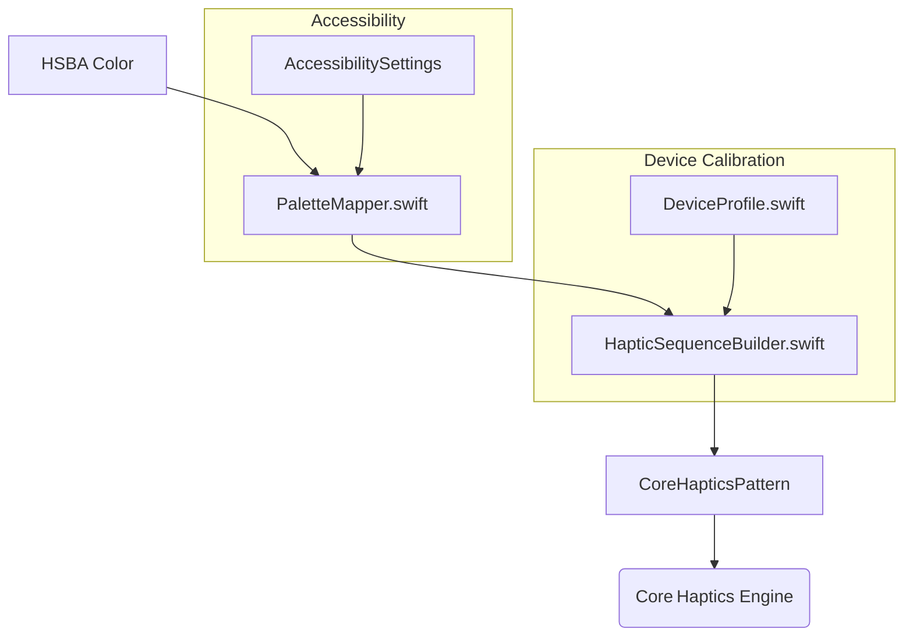

# Haptic Palette — Feature Plan (Sage)

## ✨ Summary
A reusable Swift module that converts HSBA color values into expressive Core Haptics patterns.  
The palette will be exposed as `HapticPaletteKit` and tuned to feel consistent across devices while remaining fully accessible.

---

## 🌍 Goals
1. **Color‑to‑Haptic Mapping** – Deterministically generate haptic patterns from any HSBA tuple.  
2. **Device Calibration Layer** – Auto‑scale intensity & sharpness for differing Taptic engines (A13 → A17 Pro).  
3. **Accessibility Controls** – Respect global Reduce Motion / Touch Accommodation settings and our own Sensory‑Mixer panel.  
4. **Developer API** – Provide a tiny surface:  
   ```swift
   let pattern = try HapticPalette.from(hsba: .init(h:0.6, s:0.8, b:0.9, a:1))
   hapticPlayer.play(pattern)
   ```  

---

## 🏗️ Architecture



* **PaletteMapper** – Pure function mapping HSBA → intermediate parameters (tempo, intensity, sharpness, decay).  
* **HapticSequenceBuilder** – Builds `CHHapticPattern` JSON and caches by hash.  
* **DeviceProfile** – Loads calibrated multipliers via `DeviceCalibration.plist`.  
* **AccessibilitySettings** – Injected dependency feeding real‑time overrides.

---

## 📝 Task Breakdown

| # | Task | Owner | Estimate |
|---|------|-------|----------|
| **0** | Create empty Swift package `HapticPaletteKit`. | Sage | 0.5 d |
| **1** | Implement `HSBA` value‑type with hashing & validation. | Sage | 0.5 d |
| **2** | Draft `PaletteMapper` algorithm (color → param struct). | Sage | 1 d |
| **3** | Unit‑test mapper with 30 sample colors + golden params. | Sage | 0.5 d |
| **4** | Build `HapticSequenceBuilder` → `CHHapticPattern` JSON. | Sage | 1 d |
| **5** | Add on‑device cache (hash → pattern) with LRU eviction. | Sage | 0.5 d |
| **6** | Ship calibration data (`DeviceProfile`) for iPhone 12 mini & 15 Pro. | Sage | 0.5 d |
| **7** | Integrate `AccessibilitySettings` dependency hooks. | Sage | 0.5 d |
| **8** | Smoke‑test on hardware, adjust envelopes. | Sage | 1 d |
| **9** | Doc‑gen (`DocC`) & README examples. | Sage | 0.5 d |
| **10** | Open a PR, code‑review, merge to `main`. | Sage + Peer | 0.5 d |
| **11** | Create `docs/AccessibilityReview.md` with findings. | Sage | 0.5 d |

**Total:** ~8 developer‑days.

---

## 🔄 Milestones

1. **v0.1** – Mapping + pattern builder working in Simulator.  
2. **v0.5** – Calibrated on two devices; API frozen.  
3. **v1.0** – Accessibility compliance & documentation complete.

---

## ✅ Definition of Done
- All tasks (#0‑#11) complete and CI green.  
- Patterns feel uniform on iPhone 12 mini & 15 Pro at default settings.  
- Unit coverage ≥ 90 % for mapper & builder.  
- Docs published; demo playground included.
