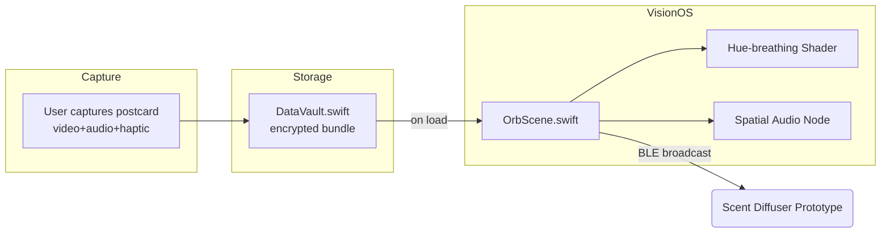

# Orb Scene Feature Plan (RFC)

### Feature / Component  
Floating postcard orbs rendered in Vision OS (`OrbScene.swift`).

### Scope of Diagram  
- End‑to‑end flow (Capture → Storage → Vision OS presentation).  
- Interaction state‑machine (Idle ▸ Hover ▸ Grab ▸ Throw ▸ Burst ▸ Reassemble).  
- BLE handshake trigger path for future scent diffusers.

### Key Edge‑Cases to Cover  
- Multiple orbs in the same frustum (z‑sorting & occlusion).  
- Missing audio asset or user not wearing AirPods → fallback stereo mix.  
- Device in Pocket mode → haptic‑only cues.  
- Performance guardrail: hold 90 fps on Vision Pro, 60 fps in Simulator.  
- Privacy: no depth buffer leak to screenshots.

### Stakeholders to Review  
Kai (spatial), Lux (palette & shader), Leo (audio loops), Iris (emotion vector), Sage (haptics), Dr Nova (BLE privacy).

### Granular Tasks (for grooming)

| ID | Story | Size (Pts) |
|----|-------|-----------|
| K‑01 | SceneKit sphere & parallax scaling scaffold | 2 |
| K‑02 | Load postcard texture & loop video | 1 |
| K‑03 | Apply Lux hue‑breathing shader | 1 |
| K‑04 | Bind spatial‑audio panning to head pose | 1 |
| K‑05 | Inject Iris emotion‑vector ambient light | 1 |
| K‑06 | Interaction: Grab, throw, inertia physics | 2 |
| K‑07 | Particle‑burst prototype (toggle) | 3 |
| K‑08 | Performance profiling & 90 fps guard | 1 |
| K‑09 | BLE UUID handshake stub + unit test | 1 |
| K‑10 | Snapshot & UX tests (Simulator) | 1 |

### Risks & Mitigations  
- **Shader overdraw spikes** → early depth‑test + GPU profiler passes.  
- **Audio drift** on long loops → periodic resync to CMSession timestamp.  
- **BLE latency** > 200 ms ruins sync → buffer scent cues 1 s ahead.

### Definition of Done  
1. Orb loads demo postcard, floats at arm’s length with stable parallax.  
2. Hue halo breathes in sync with Lux palette feed.  
3. Audio pans correctly with head movement; fallback stereo verified.  
4. Particle burst behind feature flag compiles ⚙️ OFF by default.  
5. All unit & snapshot tests green on CI; Perf > 90 fps on device.  
6. Code merged, demo video posted in #show‑and‑tell.
