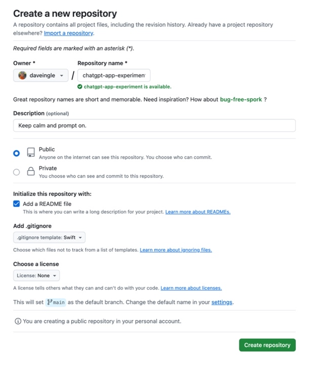
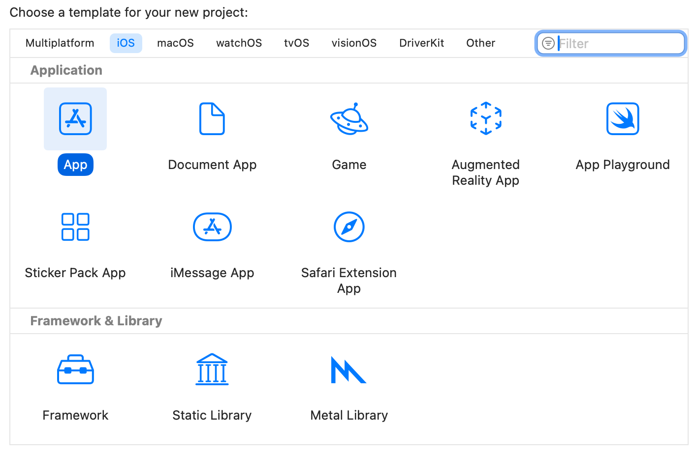
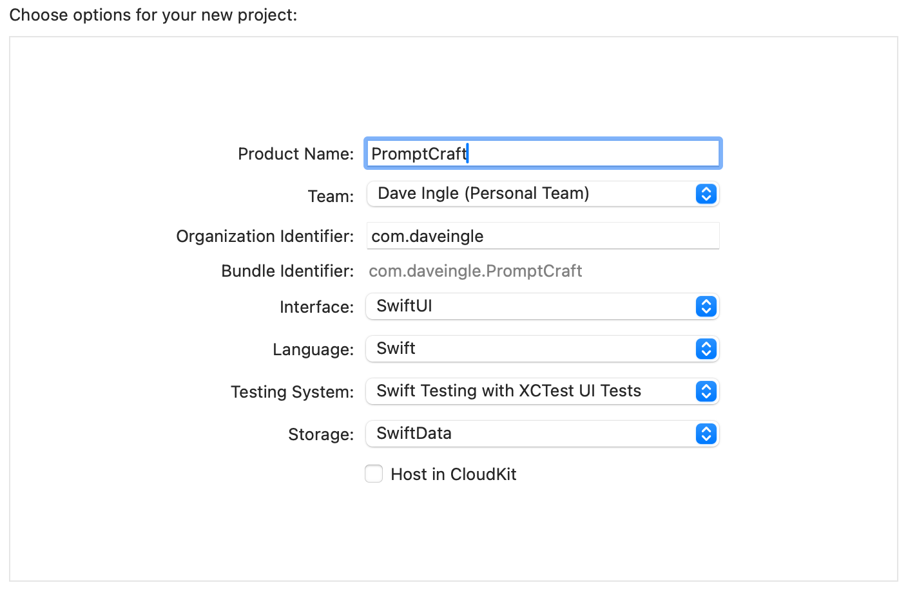
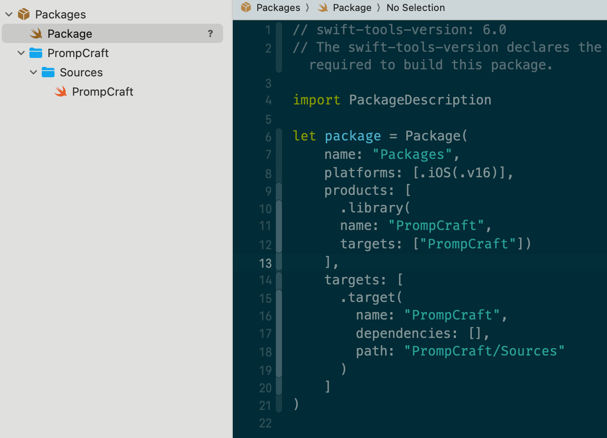
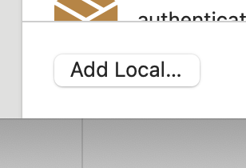
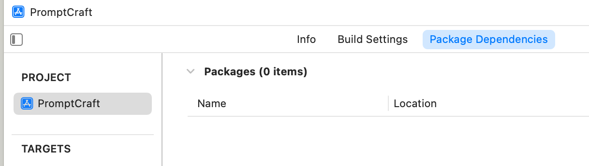
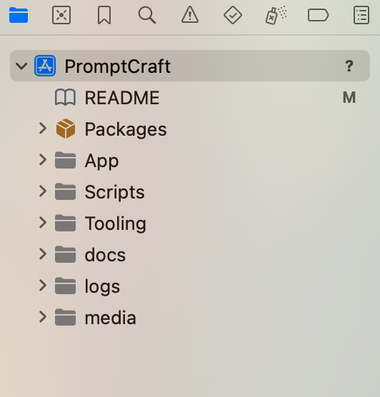
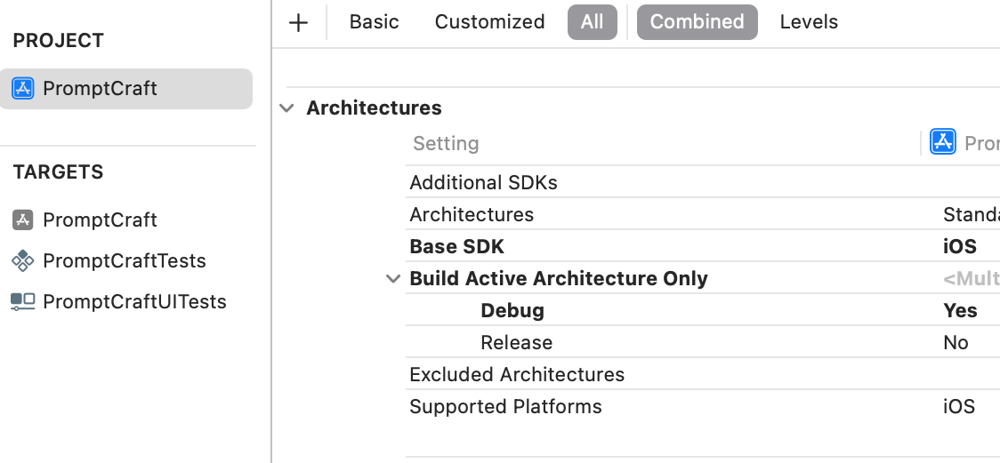
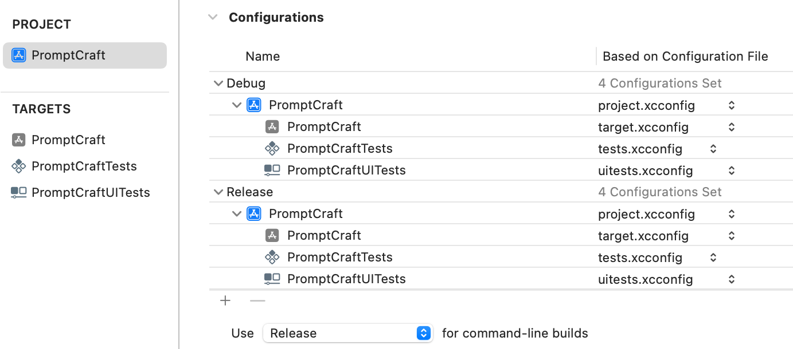
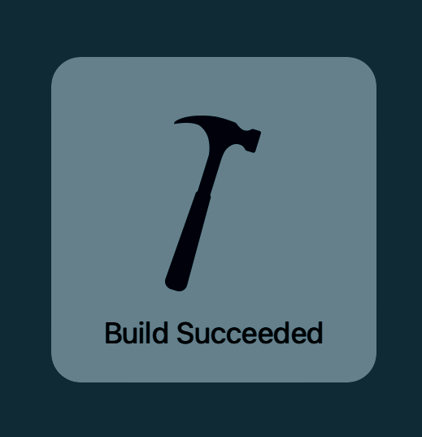

# Day 0 – It Begins

## 🗓️ Date
May 12, 2025

## 🔥 Summary
I created the GitHub repository that will house the entire project. This marks the official start of the experiment: building an iOS app by prompting ChatGPT each day and following its guidance. The journey begins with nothing but a name and a blank repo.

## 🤖 Prompt(s)
> No prompt today. Just created the GitHub repo and committed a README.

## 💬 ChatGPT Response(s)
None yet. We'll start prompting tomorrow.

## 🛠️ What I Built
- [x] Created the GitHub repository
- [x] Wrote and committed README.md
- [x] Defined the project structure

## 📸 Screenshots: Day 0 Sequence

|🧱 The very beginning. Starting clean with a public repo, a README, and the project name: `chatgpt-app-experiment`. |
|--- |
| |
|🧰 Starting with the default App template for iOS. No frills—just a clean SwiftUI starting point and Swift as the language.|
||
|💡 Gave the app its identity: `PromptCraft`. This is where the experiment begins—with a name and a mission to build via prompting.|
||
|📂 Xcode’s default file groups after project creation. Time to refactor the structure into something maintainable.|
||
|📦 Created a Swift Package named `PromptCraft` inside `Packages/` with a clean, conventional layout.|
||
|➕ Used the “Add Local…” option in Xcode to wire up the internal package cleanly.|
||
|🧼 Starting dependency-free. Keeping things local and simple.|
||
|✨ Organized the project into clearly separated folders—`App/`, `Packages/`, `logs/`, and more—making room for iteration, logs, and long-term tooling.|
||
|🧱 Don't like my settings defined in xml via the project file.|
||
|🧼 Confirmed that we haven’t deviated from defaults yet—clean slate.|
||
|🧩 Connected `.xcconfig` files across all targets. This keeps configuration declarative and scalable.|
||
|This is a good sign..|
||

## 🚧 Challenges or Oddities
- Ran into `sips` errors when trying to strip image metadata
- Switched to `exiftool` for reliable sanitization in the Git pre-commit hook
- Hook initially failed on blank file names; added safe checks for empty/missing files

## 🧠 Reflection

Day 0 was all about foundations. I wanted a clean, future-friendly structure, and I think we got there. From setting up folders like `App/`, `Packages/`, and `Tooling/` to wiring up pre-commit hooks for image hygiene, it feels like a strong start.

We’re not even writing app code yet—but the infrastructure is in place to support it.

## 🔮 Tomorrow

- Begin Day 1 by prompting ChatGPT to help design the app itself
- Decide on a concept, initial feature set, or interface
- Create the first SwiftUI screen based on the prompt
- Keep logs and screenshots going
